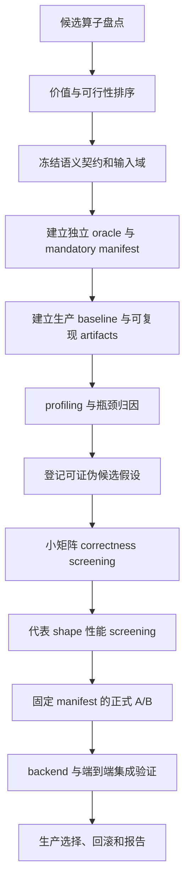

# 可靠算子优化与执行框架

## 目录

1. 目的
2. 词典序目标
3. 总流程、执行模式与授权
4. 选择优化算子
5. 冻结语义契约
6. 输入空间与 manifest
7. Baseline
8. Profiling 与候选假设
9. 分层实验与 gate
10. 性能目标与决策
11. 失败与重跑
12. Artifact 与复现
13. 实现与 Git
14. 停止条件
15. 计划模板
16. Definition of Done

## 1. 目的

本文定义一套用于“制定算子优化计划”的通用框架。它不规定某个算子必须采用何种 tile、
融合、流水或硬件指令，而是规定在开始实现前必须如何：

1. 选择值得优化的对象；
2. 冻结语义和泛化边界；
3. 建立可复现 baseline；
4. 把优化想法写成可证伪假设；
5. 用分阶段 gate 控制正确性、泛化性和性能风险；
6. 用持久状态机约束自动执行和中断恢复；
7. 形成可审计、可复现、可回滚的交付物。

核心目标是：**在正确性和泛化性是硬约束的前提下，尽可能提高真实 workload 的性能**。
性能不能通过缩窄未声明的输入域、修改指标、隐藏失败或只挑选有利样本获得。

## 2. 总原则：词典序目标，而不是加权妥协

算子候选 `c` 只有同时满足下列条件才有资格比较性能：

```text
eligible(c) = semantic_correct(c)
           and memory_safe(c)
           and generalization_pass(c)
           and measurement_reliable(c)
```

最终选择是在 eligible 集合内最小化正式 workload 的延迟或最大化吞吐：

```text
c* = argmin formal_latency_objective(c), c in eligible
```

这意味着：

- 正确性不是可以用 20% 性能收益交换的分数；
- 泛化性不是“主 shape 正确即可”的附加项；
- compile failure、NaN、越界、状态不明的 case 不能从分母中删除；
- 性能只在相同语义、相同输入、相同计时边界下比较。

## 3. 框架总流程



任何阶段未通过 gate 时，不得因为后续结果看起来更好而跳过该阶段。

### 3.1 执行模式与持久状态

执行前必须明确本轮模式：

- `review`：只读检查计划、实现或 artifacts，不修改代码，不运行 GPU 任务；
- `plan`：建立语义契约、manifest、候选假设和实验协议，不实现候选；
- `execute`：允许在冻结契约后实现、筛选和验证候选；
- `resume`：从已有 `optimization_state.json` 和不可变 artifacts 恢复，不从对话记忆猜测进度。

`execute` 和 `resume` 必须使用以下单向主状态机：

```text
discovery
  -> contract_frozen
  -> harness_ready
  -> baseline_qualified
  -> profiled
  -> candidate_screening
  -> qualification_locked
  -> integration
  -> concluded
```

每次状态迁移前必须原子写入：当前状态、已通过 gate、证据路径、当前候选、下一动作、预算
消耗和停止原因。恢复时先校验 manifest、源码和 artifact hash；不一致时停止并创建新 run，
不得覆盖旧状态。

### 3.2 自动执行授权与预算

自动执行前冻结 `optimization_spec`，至少包含：目标调用路径、支持输入域、硬件范围、主指标、
workload 权重、成功阈值、最大候选数、GPU/墙钟预算、允许修改的文件范围、外部依赖和
`commit_mode=never|checkpoint|final`。

能从代码和 artifacts 确认的字段由执行者补全；会改变语义、硬件范围、依赖、公开接口或
提交授权的缺失信息必须停止并请求确认。预算耗尽是 `inconclusive` 停止原因，不是成功。

## 4. 阶段 A：选择值得优化的算子

### 4.1 必须回答的五个问题

每个候选算子都要有代码和运行路径证据回答：

1. **调用频率**：每 token、每 layer、每 request、每 eviction，还是仅初始化一次？
2. **单次工作量**：数据量和计算量如何随 B、L、H、D 等维度增长？
3. **端到端占比**：它在目标 workload 中占 TTFT、TPOT 或总 GPU time 的多少？
4. **可优化空间**：已有实现是否存在重复工作、过多 launch/workspace、低利用率或固定参数？
5. **证据成熟度**：是否有独立 oracle、microbenchmark、真实调用入口和回归测试？

不能仅凭文件行数、kernel 名称或一次 isolated latency 选择课题。

### 4.2 候选排序表

计划中至少比较三个候选，并使用 High/Medium/Low 或 1--5 的有序等级记录：

| 维度 | 含义 |
| --- | --- |
| Runtime impact | 目标 workload 中的时间占比和调用频率 |
| Scaling pressure | 工作量是否随长文本、batch 或模型维度快速增长 |
| Headroom evidence | 是否已有 profiling 或结构证据表明存在空间 |
| Applicability | 受益方法、模型和部署场景的覆盖范围 |
| Oracle readiness | 是否能构造独立且可承受的正确性参考 |
| Integration risk | 是否涉及状态、调度、跨层语义或公开接口 |
| Experiment cost | 完整验证需要的 GPU 时间、显存和外部依赖 |

排序结论必须附证据。若缺少端到端 profile，第一阶段任务应是补 profile，而不是直接改
kernel。

### 4.3 选题停止条件

出现以下任一情况，应停止该候选并转向其他算子：

- 在代表 workload 中 GPU time 占比低于预先设定的热点阈值；
- 主要时间实际来自 Python、allocation、通信或上游同步；
- 已有成熟库实现明显更快且语义完全覆盖；
- 无法构造可信 oracle 或无法隔离计时边界；
- 预计的最优 kernel 加速无法产生有意义的端到端收益。

## 5. 阶段 B：冻结语义契约

优化计划必须先写出当前生产语义，而不是从 kernel 代码反推“看起来应该是什么”。至少
包括：

- 输入、输出 shape 和 dtype；
- 每个维度的逻辑含义；
- stride、contiguous、alignment 和 alias 约束；
- mask、padding、空输入、ragged row 和无效 index 语义；
- 数值公式、scale、reduction 顺序和 accumulator dtype；
- in-place、副作用、atomic、跨调用累积和初始化要求；
- 输出的直接消费者，以及输出是否驱动 top-k、路由、剪枝、稀疏选择等离散决策；
- CUDA Graph、stream、TP 后 local shape 等运行约束；
- 错误输入是 fail-fast、明确跳过还是受支持。

计划不得把“当前测试没有覆盖”误写成“不需要支持”。不明确的语义必须在实现前由调用链
和现有行为确认。

如果输出会驱动离散决策或直接影响模型质量，数值 `allclose` 只算最低层检查。计划必须额外
定义消费者级 exact decision gate、baseline 重复确定性检查和端到端质量非劣化 gate；性能
收益不得抵消这些 gate 的失败。

## 6. 阶段 C：设计输入空间与 mandatory manifest

### 6.1 四类输入必须同时存在

1. **生产代表值**：来自实际模型和 workload；
2. **边界值**：tile、warp、block、page、quant group 前后；
3. **真实非规则值**：非 2 次幂、非 tile 倍数、长短混合；
4. **对抗值**：空/最小、极端数值、重复 index、共享前缀、乱序和最大容量。

随机输入必须固定 seed；随机 shape 应固化为 manifest，而不是每次运行重新抽样。

### 6.2 不做无约束笛卡尔积

将输入矩阵分成：

- `mandatory_core`：生产主 shape 的完整组合；
- `pairwise_generalization`：其他轴做 pairwise/正交覆盖；
- `boundary_suite`：边界和错误输入；
- `long_or_large_suite`：通过环境变量显式开启的高成本测试；
- `end_to_end_suite`：少量真实模型/请求。

官方 run 开始后不得修改 manifest、阈值或样本包含规则。需要调整时创建新 run id，并在
报告中解释原因。

### 6.3 泛化性约束

计划必须明确如何防止以下做法：

- 按模型名路由 kernel；
- 为单个测量长度或 batch 写分支；
- 用 allowlist 掩盖本可通过 mask 支持的维度；
- 假设 contiguous 却不验证 stride；
- 把 H100 上的参数宣称为所有 GPU 的最优值；
- 只在平均值上获益但隐藏某类 shape 的系统性回退。

shape specialization 不是绝对禁止，但必须满足：语义一致、条件由 tensor geometry 或明确
配置决定、每个分支都有独立测试、性能 crossover 有跨 shape 证据。

### 6.4 开发、资格与集成矩阵分离

同一批输入不能同时承担自适应调优和最终证明：

- `development_manifest`：用于 correctness smoke、性能 screening 和候选淘汰；允许在新 run
  中扩展，但历史版本和 hash 必须保留；
- `qualification_manifest`：用于正式 A/B，在候选和阈值锁定后才运行；一旦结果用于指导
  新候选，该 manifest 标记为 `exposed`，不能再为最终结论提供独立证据；
- `integration_replay_manifest`：用于真实 backend、模型输出和端到端质量验证。

资格矩阵需要重新设计时必须创建新 run id，记录前一矩阵为何暴露或失效。正确性支持域、
性能 workload 分布和端到端 replay 应分别声明，不能用性能采样未覆盖来缩窄支持域。

## 7. 阶段 D：建立三类 baseline

### 7.1 Semantic oracle

用于证明语义，通常是显式 FP32 PyTorch/CPU 实现。要求：

- 不调用待优化 kernel 或同算法的另一 Triton kernel；
- 代码简单、可读、适合小 shape；
- 覆盖中间状态时能定位错误阶段；
- 明确 tolerance 和比较对象。

### 7.2 Production baseline

当前生产实现，是正式性能 A/B 的唯一默认 baseline。必须固定 Git commit、variant id、
编译参数、调用路径和源码 hash。候选代码不得通过共享 wrapper 或全局配置静默改变 baseline；
正式 run 必须验证 baseline source hash 和冻结值一致。

### 7.3 External cross-check

成熟库、Torch 展开实现或论文实现可用于额外交叉检查，但不能替代 semantic oracle，也不能
在语义不同的情况下作为性能结论基础。

## 8. 阶段 E：先测量，再提出候选

### 8.1 Profile 需要分层

至少测量：

- 单 kernel steady-state latency；
- 多 kernel pipeline latency；
- 首次编译与稳定运行；
- allocation/workspace 和 kernel launch 数；
- backend 调用层的总耗时；
- 少量端到端 TTFT/TPOT/吞吐。

硬件 counter 可用时记录 occupancy、register、shared、spill、HBM/L2、主要 stall；不可用时
明确标记 unavailable，并保留编译 metadata、`cuobjdump` 和未插桩 latency，不伪造数值。

### 8.2 每个候选必须可证伪

候选登记表至少包含：

| 字段 | 内容 |
| --- | --- |
| variant_id | 稳定、可写入 artifact 的唯一名称 |
| bottleneck evidence | 它针对哪项已测瓶颈 |
| primary change | 本轮唯一主要变量 |
| parent_variant_id | 该候选基于哪个已验证版本 |
| source_hash | 候选源码或 patch 的不可变 hash |
| predicted win | 哪类 shape 应改善，原因是什么 |
| predicted risk | 哪类 shape 可能回退或失败 |
| correctness impact | 是否改变 reduction、精度、mask、layout 或副作用 |
| falsification rule | 什么结果出现时淘汰该候选 |

不允许一次同时改变算法、tile、warps、stages 和 dtype，再把收益归因给其中一个因素。
单变量 screening 完成后允许登记组合候选，但必须列出父候选、组合动机和交互风险，并从
correctness 开始重新通过所有适用 gate。

## 9. 阶段 F：分层实验与 gate

### 9.1 Gate -1：设备、环境与工作区准入

- 枚举所有可见设备，记录 GPU 进程、利用率、显存、温度、功耗、时钟、MIG/MPS 状态；
- 按预注册阈值选择空闲设备；所有设备忙时先有界等待，超时后报告，不在繁忙设备上开跑；
- 检查目标依赖、profiler 权限、磁盘空间、源码 hash 和编译 cache 策略；
- 检查工作区已有改动；不得覆盖用户改动，和目标文件重叠时停止；
- 将准入快照写入 `run_info`，正式 A/B 前后再次采样，环境漂移超阈值则 run 失败。

### 9.2 Gate 0：编译与静态资源

- 所有目标架构编译成功；
- 无意外 local-memory spill；
- shared/register 不超过硬件限制；
- variant metadata 完整落盘。

### 9.3 Gate 1：小 shape correctness

- semantic oracle allclose；
- 所有有效输出 finite；
- guard/sentinel 未被越界写；
- 错误输入 fail-fast；
- 每种 dtype、layout、mask 分支至少一个 case。
- 质量敏感的离散消费者与冻结 baseline 决策完全一致。
- 每个输出使用预注册 comparator，包括 dtype、`atol/rtol`、误差统计、NaN/Inf、tie 和
  允许的非确定性；
- launch 后显式同步并检查异步 CUDA 错误。

Gate 1 未通过时禁止性能调优。

### 9.4 Gate 2：边界、泛化与内存安全

- tile 前后边界；
- 非规则 shape；
- ragged batch；
- TP 后 local head/dim；
- non-contiguous 或明确拒绝；
- CUDA Graph/stream 语义；
- 大地址和容量边界。
- 对最小、边界和非规则 case 运行 guard/redzone；可用时运行有界的 memcheck、initcheck 和
  racecheck。sanitizer 不可用时记录 `unavailable` 和原因，不能用 sentinel 结果冒充完整检查。

### 9.5 Gate 3：性能 screening

使用较小但代表性的固定矩阵快速淘汰候选。screening 结果只能决定是否进入正式 run，不能
作为最终性能结论。为降低自动搜索成本，可先通过 Gate 1 和 Gate 2 的 smoke 子集再 screening；
幸存候选必须在正式 A/B 前通过完整 Gate 2。

### 9.6 Gate 4：正式 A/B

- baseline 与 candidate 使用同一输入；
- JIT、allocation、随机生成不计入 steady-state；
- warmup、rounds、iterations 达到预注册下限；
- 使用未暴露的 `qualification_manifest`；
- baseline/candidate 以固定 seed 做成对交错，避免候选先后顺序与温度、时钟漂移混淆；
- 记录每轮原始延迟和 CV；
- 按预注册方法计算 paired ratio、置信区间和最小有意义改善；
- 必测 case 未达到预期状态或资格矩阵不完整时进程最终非零。

### 9.7 Gate 5：集成与端到端

- public wrapper/backend contract；
- eager 与 CUDA Graph；
- 多 layer、多 step；
- 真实方法的选择结果或模型输出不变；
- TTFT/TPOT/吞吐和显存无不可接受回退。

## 10. 性能目标与决策规则

### 10.1 预先注册目标

每个计划在跑正式数据前写明：

- 主指标：latency、throughput、TTFT 或 TPOT；
- 聚合：几何平均、加权几何平均或分桶结果；
- workload 权重；
- 最小有意义改善；
- 单 case 最大回退；
- 编译时间和额外显存上限；
- 端到端最低收益。
- 环境准入阈值和统计置信方法；
- 最大正式候选数，避免从大量候选中挑最幸运结果。

阈值在看到正式结果后不能原地修改。修改阈值必须生成新 run，并保留旧结果。

### 10.2 不只看一个平均数

正式报告至少同时给出：

- 总体几何平均；
- 按 batch、长度、dtype、layout、硬件分组；
- 最差 case 和最优 case；
- 绝对 latency，不只给 speedup；
- paired ratio 的置信区间和低于最小有效改善的 case；
- 失败状态和重跑记录；
- kernel 指标与端到端指标。

### 10.3 生产选择

候选只有同时满足 correctness、generalization、formal performance 和 integration gate 才能
进入生产。局部 winner 可以保留为研究 variant，但不得自动成为 dispatch 分支。

## 11. 失败状态与重跑规则

每个 sample 必须是以下状态之一：

```text
success
invalid_input
model_failed
parse_failed
metric_failed
skipped_by_policy
```

顶层状态保持统一，但算子实验必须同时记录：

```text
stage
failure_kind
expected_status
gate_result
attempt
first_attempt_ref
reason
```

`model_failed` 是兼容性的执行失败总类，必须通过 `failure_kind` 细分为 compile、ptxas、
launch、oom、timeout 或其他明确原因。`metric_failed` 必须细分 nonfinite、incorrect、oob、
race、noisy_measurement 或 profiler_metric。

非法输入测试应预注册 `expected_status=invalid_input`；观察状态与预期一致时
`gate_result=pass`。有效 required case 默认 `expected_status=success`。聚合 gate 判断
`gate_result`，不能错误地要求负向测试本身返回 `success`。

规则：

- compile/launch/OOM/NaN 不得降级为 warning；
- CV 超阈值标记 `metric_failed`；
- 首次失败 artifact 永久保留；
- 只允许在独立新进程中重跑完全相同 case；
- 每类失败的最大重跑次数必须预注册且有限；
- 重跑不得改变 seed、阈值或输入；
- 合并报告必须同时披露首次失败和成功重跑；
- 不允许用 candidate 失败时自动运行 baseline 并把它记为 candidate 结果。

## 12. Artifact 与复现契约

控制 run 至少保存以下内容；`decision.json` 只在形成结论时生成：

```text
optimization_spec.json
optimization_state.json
run_info.json
case_manifest.json
hypotheses.jsonl
command_log.jsonl
raw_outputs.jsonl
parsed_outputs.jsonl
per_sample_results.jsonl
aggregate_metrics.json
compile_metadata.jsonl
decision.json
report.md
ncu/ 或 profiler 原始目录
```

`run_info` 至少包含：Git commit/dirty status、完整 argv、seed、GPU UUID、驱动、CUDA、
Torch、Triton、时钟/功耗信息、warmup/rounds/iterations、manifest hash 和计时边界。

所有 JSON/JSONL 必须包含 `schema_version`，`run_info` 还要记录框架文件 hash、目标源码 hash、
依赖锁文件 hash 和 artifact 索引。状态和最终决策使用临时文件加原子 rename 写入；已完成
run 不得原地追加或覆盖。

`optimization_state` 保存当前状态、gate、候选队列、预算、下一动作和停止原因；
`hypotheses` 保存候选预测与证伪结论；`command_log` 保存命令、cwd、环境差异、开始/结束时间和
返回码；`decision` 只能是 `selected`、`no_improvement`、`inconclusive` 或 `blocked`，并引用
支持该结论的 gate 和 artifact。

原始输出、解析输出、逐 sample 状态和聚合指标分开保存，避免报告生成逻辑覆盖原始证据。

## 13. 实现与 Git 策略

- baseline 建立后先提交测试/harness，再开始候选实现；
- 每个主要候选保持小而可回滚的 Conventional Commit；
- 生产 wrapper 与 research variant 分离；
- 不在正式 run 期间修改 manifest 或 kernel；
- 不混入无关重构、依赖升级和用户工作区改动；
- 最终提交前运行 diff review、相关 suite 和必要端到端测试。

提交动作受 `optimization_spec.commit_mode` 约束。没有提交授权时，用源码 hash、patch 和
artifact 记录 checkpoint，不自动 commit、stash 或清理用户改动。需要隔离候选时优先使用
独立分支或 worktree，但不得未经确认移动或删除现有工作区状态。

## 14. 停止条件

满足以下任一条件应停止继续调优并形成结论：

- 已达到预注册性能目标且下一候选预计收益低于测量噪声；
- 连续多个正交候选均未改善，profile 表明已接近硬件/库上限；
- kernel 加速无法带来预设的端到端收益；
- 进一步收益要求缩窄语义或引入不可接受的泛化分支；
- 正确性或资源风险超过该热点的潜在收益；
- 当前证据不足，需要先补真实 workload、checkpoint 或 profiler 权限。
- 达到预注册候选数、GPU 时间或墙钟预算。

“预算用完”对应 `inconclusive`，不是成功；“候选没有收益”可以是 `no_improvement` 的有效研究
结论，但必须有完整证据。

## 15. 标准优化计划模板

每个具体算子计划必须包含以下章节：

1. **结论边界**：目标、硬件、方法、非目标；
2. **选题证据**：调用链、热点占比、候选比较；
3. **语义契约**：公式、shape、dtype、stride、mask、副作用；
4. **已知事实与假设**：两者分开；
5. **baseline**：oracle、production、external；
6. **mandatory manifest**：生产、边界、非规则、对抗、长测试；
7. **候选登记表**：variant、主要变量、预测、风险、淘汰条件；
8. **分阶段 gate**：compile、correctness、generalization、screening、formal、integration；
9. **性能协议**：计时、聚合、阈值、资源指标；
10. **artifact 与状态**：目录、schema、失败规则；
11. **集成与回滚**：dispatch、配置、兼容和回滚点；
12. **自动执行契约**：模式、状态机、设备准入、预算和提交授权；
13. **停止条件与交付物**。

## 16. Definition of Done

只有全部满足才算完成：

- [ ] 语义契约和输入域已冻结；
- [ ] 独立 oracle 覆盖 mandatory matrix；
- [ ] development、qualification 和 integration manifest 已分离并记录暴露状态；
- [ ] baseline 与 candidate 使用稳定 variant id；
- [ ] 所有 required sample 有明确状态；
- [ ] 正确性、泛化、正式性能和集成 gate 全部通过；
- [ ] 最差 case、失败和重跑均已披露；
- [ ] artifacts 足以在同类硬件复现；
- [ ] 状态机、命令日志、候选 hash 和最终 `decision.json` 完整；
- [ ] 生产实现没有模型名或单 shape 特判，除非有充分证据和测试；
- [ ] 端到端指标达到预注册目标；
- [ ] 代码、测试、报告和回滚方案已提交；
- [ ] 未解决限制明确写入报告。

该框架的价值不在于保证每次都找到更快实现，而在于保证任何性能结论都建立在可验证的
正确性、泛化性和可复现证据之上。
