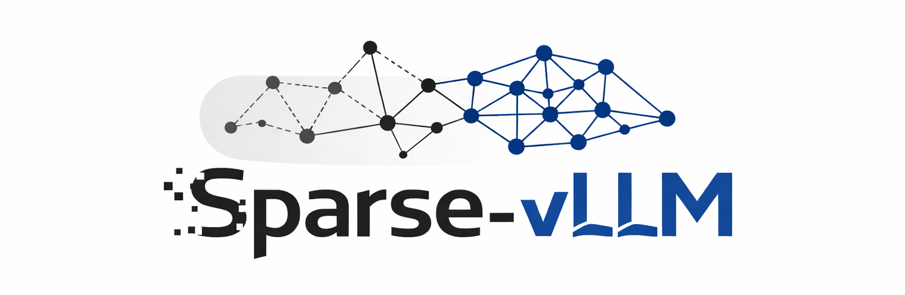
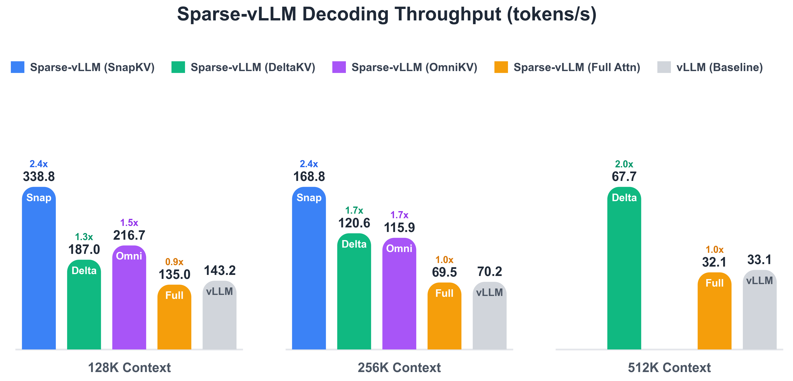

<div align="center">
  

  <p>
    <a href="https://deepwiki.com/CURRENTF/Sparse-vLLM"></a>
    <a href="https://arxiv.org/abs/2602.08005"></a>
    <a href="https://arxiv.org/pdf/2602.08005.pdf"></a>
  </p>
</div>

<p align="center"><a href="README.md">English</a> | 简体中文</p>

Sparse-vLLM 是一个面向长上下文大语言模型服务、以稀疏机制为首要设计原则的推理引擎，同时也包含 DeltaKV 压缩器的训练与评测工具。

<div align="center">
  
</div>

## 项目概览

Sparse-vLLM 是一个从设计之初就以稀疏性为核心原则的推理框架。它并非简单地在传统 KV 缓存之上叠加稀疏方法，而是重新设计缓存布局、控制流程和内核，使多种稀疏机制能够清晰地接入框架。

与 DeltaKV 相关的压缩器训练、Hugging Face 封装对比和基准测试适配器位于 `src/deltakv/` 和 `benchmark/` 目录中。

## 核心运行原则

- 对外命令和 `LLM(...)` 关键字参数应使用 `sparse_method`；Sparse-vLLM 会在内部将其规范化为 `vllm_sparse_method`。
- 稀疏方法的运行时状态应放在 `src/sparsevllm/engine/cache_manager/` 中；`attention.py` 应保持通用。
- 预填充调度由各方法自行定义并通过注册表管理。其唯一事实来源是 `src/sparsevllm/method_registry.py`，而不是基准测试脚本。
- Sparse-vLLM 当前使用两种预填充策略：`all_chunked` 和特殊的 `long_bs1full_short_batch` 策略。
- `long_bs1full_short_batch` 仅适用于注册时声明需要在稀疏化或缓存转换前完成一次完整长预填充的方法。长请求以批大小 1 执行完整预填充，短请求仍使用分块批处理。
- 基准测试报告应记录稀疏方法、预填充策略、预填充分块大小、提示词长度、批大小以及所用的 DeltaKV 检查点。

## 核心稀疏方法

Sparse-vLLM 支持物理淘汰、逻辑掩码、查询感知选择和混合 KV 压缩。主要方法系列包括 `streamingllm`、`snapkv`、`pyramidkv`、`omnikv`、`quest` 和 `deltakv`。

| 方法 | 类型 | 简介 |
| --- | --- | --- |
| `vanilla` | 稠密基线 | 执行完整注意力计算并保留标准 KV 缓存行为，作为正确性和性能基线。 |
| `streamingllm` / `attention-sink` | 物理淘汰 | 保留固定的注意力汇聚 token 和最近窗口，并物理淘汰策略范围之外的旧 token。 |
| `snapkv`、`pyramidkv` | 物理淘汰 | 在预填充或收尾阶段选择重要的历史 token，仅存储保留下来的 KV token。 |
| `omnikv` | 逻辑掩码 | 保留存储中的 token，但对注意力读取视图进行掩码，使稀疏层仅关注选定的上下文。 |
| `quest` | 查询感知选择 | 保持预填充阶段为稠密计算，在解码阶段使用查询感知的分页选择。 |
| `deltakv` / `deltakv-*` | 混合压缩 | 保留一个小型全精度池，并通过 DeltaKV 压缩或相关消融方法存储较早的上下文。 |

方法概览和集成规则请参阅[核心稀疏方法](docs/features/sparse-methods.md)。

## 文档

| 主题 | 链接 |
| --- | --- |
| 快速配置与最小用法 | [快速开始](docs/getting_started/README.md) |
| 稀疏方法分类与扩展规则 | [核心稀疏方法](docs/features/README.md) |
| 运行时架构 | [架构](docs/design/README.md) |
| 运行时参数语义 | [运行时参数语义](docs/configuration/runtime-parameter-semantics.md) |
| 基准测试命令 | [基准测试](docs/benchmarking/README.md) |
| DeltaKV 推理与训练 | [DeltaKV](docs/features/deltakv.md) |
| 可复现性检查清单 | [可复现性](docs/getting_started/reproducibility.md) |

完整文档索引维护在 [docs/README.md](docs/README.md) 中。

## 快速开始

Sparse-vLLM 需要 Python 3.10 或更高版本。请在仓库根目录中，使用
`pyproject.toml` 固定的运行时版本安装软件包。

### Conda

```bash
conda create -n svllm python=3.10 -y
conda activate svllm

pip install torch==2.11.0 torchvision==0.26.0 triton==3.6.0 \
  --index-url https://download.pytorch.org/whl/cu130

# FlashInfer 在单独的索引中发布 CUDA 专用 JIT 缓存。
pip install "flashinfer-jit-cache>=0.6.14" \
  --index-url https://flashinfer.ai/whl/cu130

MAX_JOBS=8 pip install flash-attn --no-build-isolation
pip install -e .
```

PyTorch wheel 自带 CUDA 运行时，而 `flash-attn` 等编译扩展使用当前环境中
启用的 CUDA 工具链。

### uv

```bash
uv venv --python 3.10
source .venv/bin/activate
uv pip install torch==2.11.0 torchvision==0.26.0 triton==3.6.0 \
  --index-url https://download.pytorch.org/whl/cu130
uv pip install "flashinfer-jit-cache>=0.6.14" \
  --index-url https://flashinfer.ai/whl/cu130
MAX_JOBS=8 uv pip install flash-attn --no-build-isolation
uv pip install -e .
```

以上显式索引分别用于安装 CUDA 13.0 版本的 PyTorch 和 FlashInfer JIT
缓存。

Qwen3.5/Qwen3.6 FP8 混合注意力推理还需要安装 CUDA 专用的可选依赖：

```bash
# uv
uv pip install -e ".[qwen35]"

# Conda/pip
pip install -e ".[qwen35]"
```

完整依赖列表和最小 `LLM(...)` 示例请参阅[快速开始](docs/getting_started/README.md)。

## 基准测试

使用 `scripts/benchmarks/bench_sparse_vllm.py` 测量吞吐量，并通过 `benchmark/` 下的入口进行 LongBench、MathBench、SCBench、NIAH 和多模态评测。

命令示例和后端说明请参阅[基准测试](docs/benchmarking/README.md)。

## 贡献稀疏方法

新增稀疏方法应将方法专用的运行时状态保存在 `src/sparsevllm/engine/cache_manager/` 中，并保持 `src/sparsevllm/layers/attention.py` 的通用性。

## 致谢

本项目受到以下项目的启发，并参考了其中的理念和实现技术：

- `LightLLM` (`ModelTC/LightLLM`)
- `ShadowKV` (`ByteDance-Seed/ShadowKV`)
- `nano-vllm` (`GeeeekExplorer/nano-vllm`)

## 许可证

[Apache License 2.0](LICENSE)

## 引用

```text
@article{hao2026deltakv,
  title={DeltaKV: Residual-Based KV Cache Compression via Long-Range Similarity},
  author={Hao, Jitai and Huang, Qiang and Wang, Yaowei and Zhang, Min and Yu, Jun},
  journal={arXiv preprint arXiv:2602.08005},
  year={2026}
}

@inproceedings{hao2025omnikv,
  title={Omnikv: Dynamic context selection for efficient long-context llms},
  author={Hao, Jitai and Zhu, Yuke and Wang, Tian and Yu, Jun and Xin, Xin and Zheng, Bo and Ren, Zhaochun and Guo, Sheng},
  booktitle={The Thirteenth International Conference on Learning Representations},
  year={2025}
}
```
