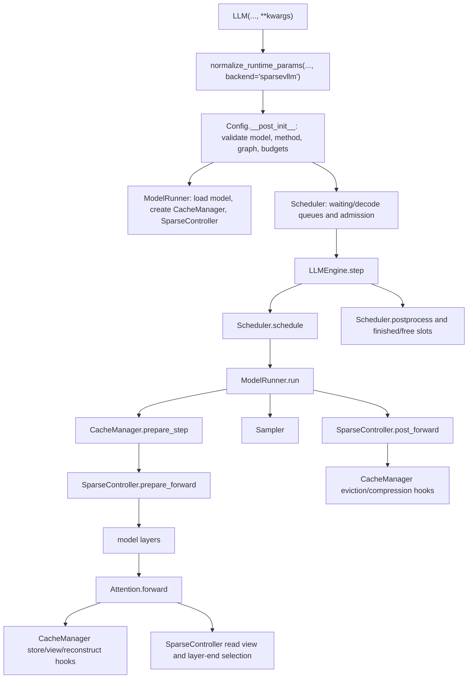

# Sparse-VLLM Control Map

Date: 2026-06-12

This is a working map for recovering control of the Sparse-VLLM side of the
repo. It is not a benchmark result and should not be cited as evidence for a
method claim. Use it to decide where a change belongs, which docs to trust, and
which checks to run before reporting results.

## Current Snapshot

- Local `main` is clean and ahead of `origin/main` by four dynamic-stride /
  RULER-VT analysis commits only. Those commits do not change Sparse-VLLM
  runtime code.
- The current Sparse-VLLM complexity mainly comes from already-merged
  DeltaKV, CUDA graph, full-layer KIVI, Qwen3, and cache-manager API work.
- `docs/experiments.md` is a run ledger. It records in-progress, aborted, and
  superseded runs as well as completed checks. Do not treat the last matching
  text search hit as the current truth without checking the status line.
- `docs/code_change_history/` records completed implementation episodes. These
  files are better for understanding root causes and validation scope.
- `docs/runtime-parameter-semantics.md` is the canonical parameter contract.
  Keep it synchronized before adding new public run configs.

## One Sentence Model

Sparse-VLLM is a sparse-first inference engine where `Scheduler` decides what
runs, `ModelRunner` executes it, `Attention` calls generic hooks, and
`CacheManager` implementations own method-specific cache state, allocation,
views, reconstruction, and graph-stable metadata.

## Runtime Flow



## Directory Ownership

| Path | Role | Ownership rule |
| --- | --- | --- |
| `src/sparsevllm/config.py` | Runtime dataclass, validation, graph constraints, method-normalized defaults. | Public knob behavior must be mirrored in `docs/runtime-parameter-semantics.md`. |
| `src/sparsevllm/method_registry.py` | Sparse method aliases and default prefill policy. | New method strings and policy defaults start here. |
| `src/sparsevllm/engine/llm_engine.py` | Public engine lifecycle, tokenizer, scheduler loop, warmup, throughput logging. | Should not grow method-specific runtime logic. |
| `src/sparsevllm/engine/scheduler.py` | Prefill/decode batching, long/short separation, prompt admission, preemption. | Uses cache-manager budget hooks instead of knowing method internals. |
| `src/sparsevllm/engine/model_runner.py` | Model load, TP RPC, CUDA graph runners, prepare/run/sample orchestration. | Owns execution mechanics, not token-selection policy. |
| `src/sparsevllm/engine/cache_manager/base.py` | Cache-manager interface and method routing. | Method-specific persistent state belongs behind this interface. |
| `src/sparsevllm/engine/cache_manager/*.py` | Physical/logical KV state for each sparse method. | This is the primary place for sparse-method implementation. |
| `src/sparsevllm/engine/sparse_controller.py` | Cross-layer attention-score collection, dynamic token selection, post-forward compression triggers. | Keep persistent method metadata in cache managers, not here. |
| `src/sparsevllm/layers/attention.py` | Generic KV store + attention kernel dispatch + hook calls. | Add generic hooks if needed; avoid method-specific branches. |
| `src/sparsevllm/triton_kernel/` | Kernel implementations. | Kernel wrappers should fail fast on invalid shape/dtype assumptions. |
| `src/deltakv/` | HF wrappers, compressor training, HF-side caches and model integration. | Use for HF parity and compressor behavior, not Sparse-VLLM engine ownership. |
| `benchmark/` and `scripts/` | Evaluation, debugging, analysis, throughput scripts. | Preserve raw outputs, parsed outputs, per-sample status, aggregate metrics, and run info separately. |

## Method Families

| Family | Sparse-VLLM method names | Core behavior | Main files |
| --- | --- | --- | --- |
| Dense | `vanilla` / `""` | Full KV cache, no sparse selection. | `standard.py`, generic attention path |
| Streaming window | `streamingllm`, `attention-sink`, `attention_sink` | Physical eviction to sink + recent tokens. | `streamingllm.py`, `standard.py`-style mechanics |
| SnapKV / PyramidKV | `snapkv`, `pyramidkv` | Physical eviction after score-based keep selection; PyramidKV changes per-layer budgets. | `snapkv.py`, `sparse_controller.py` |
| OmniKV | `omnikv` | Logical masking/view building from observation-layer scores. Full layers should be model-calibrated with `scripts/analysis/select_omnikv_full_layers.py` and then passed as `full_attention_layers`. | `omnikv.py`, `sparse_controller.py`, `omnikv_fused.py` |
| QuEST | `quest` | Query-aware decode page/chunk selection. | `quest.py` |
| DeltaKV | `deltakv` | Compressor-backed hybrid cache: sparse full/reference pool plus compressed latent state. | `deltakv.py`, `deltakv_kernels.py` |
| DeltaKV less-memory | `deltakv-less-memory` | No-checkpoint direct residual quantization ablation; reuses DeltaKV selection semantics. | `deltakv_less_memory.py`, `deltakv_kernels.py` |

## State Ownership Contracts

- `Sequence` owns request-local counters: prompt length, prefilled length,
  current chunk size, generated tokens, and finished status.
- `Scheduler` owns queue membership and admission decisions. It must ask the
  cache manager for costs, budgets, and full-prefill routing.
- `CacheManager` owns physical slots, row maps, full/sparse pools, compressed
  lengths, graph-stable metadata, temporary reconstruction slots, and method
  allocation arithmetic.
- `SparseController` owns per-step, per-layer sparse state and cross-layer
  propagation of selected indices. It should not own long-lived cache metadata.
- `Attention` owns neither policy nor persistent state. It stores current K/V,
  asks for the read view, runs generic prefill/decode kernels, and invokes
  layer-end hooks.
- CUDA graph runners own graph capture/replay mechanics; cache managers provide
  graph-stable buffers and plan references.

## Where Control Is Currently Hardest

| File | Why it is hard | How to approach it |
| --- | --- | --- |
| `src/sparsevllm/engine/cache_manager/deltakv_less_memory.py` | Very large direct-residual/full-layer-KIVI/static-graph implementation. | Treat as several logical regions: allocation, prefill staging, full-layer KIVI, sparse raw/ref views, static decode plan, reconstruction/writeback. Add tests around the region touched. |
| `src/sparsevllm/engine/cache_manager/deltakv.py` | Compressor-backed V4 path combines clustering, latent storage, full pool, staging, reconstruction, and graph hooks. | Avoid cosmetic edits. Change only with a focused HF-vs-Sparse or kernel comparison. |
| `src/sparsevllm/engine/sparse_controller.py` | Cross-layer policy for OmniKV, DeltaKV, SnapKV, PyramidKV, score dtype, and debug capture all meet here. | Keep new persistent state out. Only add orchestration or score/selection logic here. |
| `src/sparsevllm/layers/attention.py` | Small enough, but high blast radius because every method passes through it. | Keep it method-agnostic. Prefer adding a cache-manager hook over adding a branch here. |
| `docs/experiments.md` | Contains mixed completed, running, aborted, and superseded records. | Search by date and status. Extract only completed checks when making claims. |

## Current Qwen3 DeltaKV Status

As of the latest local docs:

- Qwen3 text-only Sparse-VLLM DeltaKV is no longer a blanket unsupported path.
- The strongest current correctness gate is the 2026-06-11 23:19 cache-API
  logits check in `docs/experiments.md`: Qwen3-4B, HF
  `delta_compressed_quant_kivi_full_fp8_ref` vs Sparse-VLLM
  `deltakv-less-memory`, HotPotQA sample, three teacher-forced decode steps,
  eager and decode-CUDA-graph paths all kept argmax/top1 aligned.
- The 2026-06-11 23:26 vanilla/OmniKV regression check also passed after the
  cache-manager API changes.
- The 2026-06-11 23:35/23:39 Qwen3 LongBench bs500 stress run was not a scored
  result; it was waiting/relaunched and then aborted by user request.
- The 2026-06-11 23:41 SCBench Qwen3 run had completed smoke and was recorded
  as full running. Do not report final SCBench numbers until the documented
  completion criteria and row counts are satisfied.
- Older notes in `docs/code_change_history/qwen3-prefill-batch-kivi-2026-06-12.md`
  include intermediate decode-mismatch probes. Those are useful for root-cause
  history, but later `docs/experiments.md` entries supersede them for the
  cache-manager API state.

## Change Guardrails

Before changing Sparse-VLLM runtime code:

1. Identify the backend: HF, Sparse-VLLM, or both.
2. Identify the method family and graph mode: eager, decode graph, prefill
   graph, or both.
3. Identify the state owner. If the state persists across steps, it belongs in
   a cache manager.
4. Do not use legacy public runtime names in new configs. Use
   `sparse_method`, `deltakv_checkpoint_path`, `decode_keep_tokens`,
   `prefill_keep_tokens`, `sink_keep_tokens`, `recent_keep_tokens`,
   `full_attention_layers`, `hf_prefill_chunk_size`, and
   `engine_prefill_chunk_size`.
5. Sparse-VLLM keep budgets are token counts, not ratios.
6. Any fallback must be explicit and documented. Do not silently ignore bad
   configs, missing checkpoints, missing datasets, failed parses, or failed
   metrics.
7. If adding or refactoring a sparse method, follow
   `skills/add-sparse-method/SKILL.md`: cache-manager first, generic
   `attention.py`, method state out of `utils/`.

## Minimal Local Checks

Cheap checks that do not require model weights, but do require the project
runtime environment from `README.md` or equivalent dependencies
(`torch`, `triton`, `transformers`, etc.):

```bash
PYTHONPATH=$PWD:$PWD/src python -m py_compile \
  src/sparsevllm/config.py \
  src/sparsevllm/method_registry.py \
  src/sparsevllm/engine/cache_manager/base.py \
  src/sparsevllm/engine/scheduler.py \
  src/sparsevllm/engine/model_runner.py \
  src/sparsevllm/engine/sparse_controller.py \
  src/sparsevllm/layers/attention.py

PYTHONPATH=$PWD:$PWD/src python -m unittest \
  tests.test_runtime_param_normalization \
  tests.test_prefill_schedule_policy \
  tests.test_sampler

git diff --check
```

CUDA checks for DeltaKV kernel/cache changes:

```bash
CUDA_VISIBLE_DEVICES=<GPU> PYTHONPATH=$PWD:$PWD/src python -m unittest \
  tests.test_deltakv_less_memory_kernel
```

Correctness checks before claiming HF/Sparse parity:

```bash
CUDA_VISIBLE_DEVICES=<GPU> PYTHONPATH=$PWD:$PWD/src python \
  scripts/debug/compare_logits_hf_sparsevllm.py \
  --model_path <MODEL_DIR> \
  --compressor_path <COMPRESSOR_DIR> \
  --cases longbench \
  --methods deltakv \
  --sparse_method deltakv-less-memory \
  --hf_sparse_method delta_compressed_quant_kivi_full_fp8_ref \
  --longbench_task hotpotqa \
  --longbench_sample_idx 0 \
  --teacher_forced_decode_steps 3 \
  --output_dir <OUTPUT_DIR> \
  <explicit sparse/runtime params>
```

Throughput checks after correctness:

```bash
CUDA_VISIBLE_DEVICES=<GPU> PYTHONPATH=$PWD:$PWD/src python \
  scripts/benchmarks/bench_sparse_vllm.py \
  --model_path <MODEL_DIR> \
  --methods <method> \
  --lengths <prompt_tokens> \
  --batch_sizes <batch_size> \
  --output_len <tokens> \
  --hyper_params '<canonical JSON params>'
```

## Cleanup Candidates

These are control-restoring tasks, not urgent correctness fixes:

1. Add an immutable `requested_sparse_method` or run-info field before
   cache-manager creation mutates `config.vllm_sparse_method` for DeltaKV
   variants. This would make logs and artifacts easier to interpret.
2. Make RoPE ownership explicit in cache managers. `docs/todo.md` already notes
   that cache managers should manage RoPE or related position modules; the
   Qwen3 theta/dtype fixes show why this matters.
3. Add a small status index for `docs/experiments.md` so active, aborted,
   superseded, and completed runs are easy to distinguish.
4. Avoid splitting the giant DeltaKV cache managers until a functional change
   touches the exact region. When splitting, preserve tests around allocation,
   staging, graph metadata, and reconstruction separately.
5. Keep `docs/runtime-parameter-semantics.md` synchronized whenever method
   aliases, graph support, or public knobs change.
